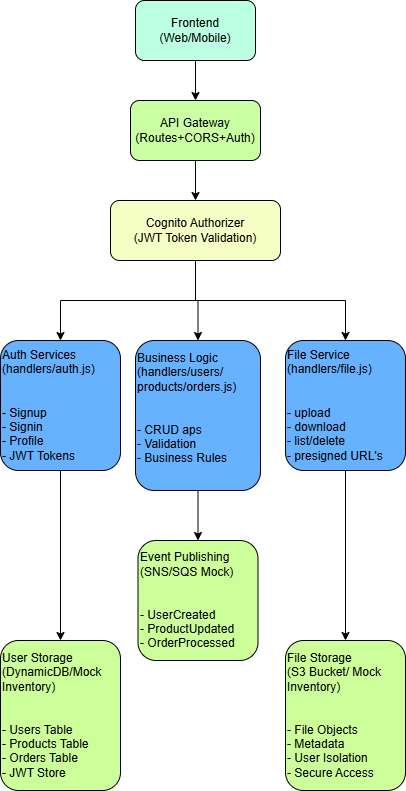
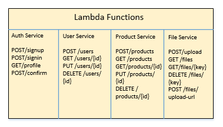
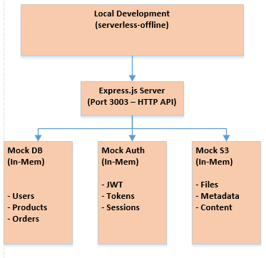
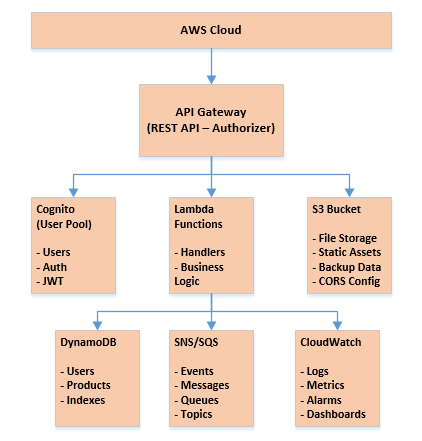
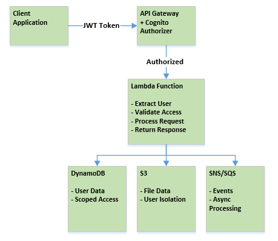

# AWS CRUD Microservices

This project demonstrates a complete serverless CRUD microservices architecture using **8 core AWS services**: Lambda, API Gateway, DynamoDB, Cognito, S3, SNS, SQS, and CloudWatch. It includes comprehensive local development support with LocalStack integration and in-memory mocking for quick testing.

## AWS Services Used

### ✅ **Core AWS Services Implemented:**

| AWS Service | Purpose | Implementation | Local Development |
|-------------|---------|----------------|-------------------|
| **AWS Lambda** | Serverless compute functions | 8 handler functions for auth, users, products, orders, files, notifications | Serverless-offline |
| **AWS API Gateway** | REST API endpoints & routing | HTTP events, CORS, path parameters, Cognito authorizers | Express.js server |
| **AWS DynamoDB** | NoSQL database | 3 tables (Users, Products, Orders) with PAY_PER_REQUEST billing | In-memory Map storage |
| **AWS Cognito** | User authentication & authorization | User Pool + Client with JWT token validation | Mock JWT with HMAC-SHA256 |
| **AWS S3** | Object storage for files | File upload/download/list/delete with CORS | LocalStack + in-memory fallback |
| **AWS SNS** | Event publishing | Event notifications for CRUD operations | Console logging mock |
| **AWS SQS** | Message queuing | Async message processing for notifications | Console logging mock |
| **AWS CloudWatch** | Monitoring & logging | Custom metrics and structured logging | Local console output |

### 🔧 **Additional Technologies:**
- **LocalStack**: Local AWS service emulation
- **Serverless Framework**: Infrastructure as Code
- **Node.js 18.x**: Runtime environment  
- **Jest**: Unit testing framework
- **Joi**: Input validation
- **JWT**: Token-based authentication

## Features
- User, Product, Order, and Notification microservices
- **AWS S3 File Storage** - Upload, download, list, and delete files with LocalStack support
- **JWT Authentication & Authorization** - Secure API access with user-scoped permissions
- Input validation with Joi
- Messaging with SNS and SQS (mocked for local development)
- Local development with in-memory database mocking
- **LocalStack Integration** - Full local AWS service emulation
- **In-Memory Fallback** - Mock storage when LocalStack unavailable
- Unit tests with Jest

## Project Structure
```
handlers/         # Lambda function handlers for each microservice
  users.js        # User CRUD operations
  products.js     # Product CRUD operations  
  orders.js       # Order CRUD operations
  notifications.js# Event processing
  auth.js         # Authentication (signup, signin, profile)
  files.js        # File storage operations (S3 integration)
utils/            # Shared utility modules
  dynamodb.js     # Database operations (with local mocking)
  messaging.js    # SNS/SQS operations (with local mocking)
  mockdb.js       # In-memory database for local development
  mockAuth.js     # In-memory authentication for local development
  validation.js   # Joi validation schemas
  response.js     # HTTP response utilities
  extractUser.js  # User extraction utilities
  auth.js         # JWT token handling
  s3.js           # S3 operations with LocalStack support
tests/            # Jest test files
serverless.yml    # Serverless Framework configuration
package.json      # Project dependencies and scripts
docker-compose.yml# Local AWS service emulation (optional)
S3_INTEGRATION.md # Detailed S3 integration documentation
```

## Quick Start

### Prerequisites
- Node.js 20.x (use nvm-windows to manage versions)
- Serverless Framework (`npm install -g serverless`)

### Setup
1. **Clone and install dependencies:**
   ```bash
   git clone <your-repo>
   cd aws-tutorial-1
   npm install
   ```

2. **Set environment variables for local development:**
   ```bash
   # For Git Bash/WSL
   export AWS_ACCESS_KEY_ID=test
   export AWS_SECRET_ACCESS_KEY=test
   export IS_OFFLINE=true

   # For Windows Command Prompt
   set AWS_ACCESS_KEY_ID=test
   set AWS_SECRET_ACCESS_KEY=test
   set IS_OFFLINE=true

   # For PowerShell
   $env:AWS_ACCESS_KEY_ID="test"
   $env:AWS_SECRET_ACCESS_KEY="test"
   $env:IS_OFFLINE="true"
   ```

3. **Start the local server:**
   ```bash
   serverless offline
   ```

4. **API will be available at:** `http://localhost:3000`

## API Endpoints

### Authentication (New!)
- **Sign Up:** `POST http://localhost:3000/dev/auth/signup`
  ```bash
  curl -X POST http://localhost:3000/dev/auth/signup \
    -H "Content-Type: application/json" \
    -d '{"email":"user@example.com","password":"TestPass123","name":"John Doe"}'
  ```

- **Sign In:** `POST http://localhost:3000/dev/auth/signin`
  ```bash
  curl -X POST http://localhost:3000/dev/auth/signin \
    -H "Content-Type: application/json" \
    -d '{"email":"user@example.com","password":"TestPass123"}'
  ```

- **Get Profile:** `GET http://localhost:3000/dev/auth/profile` (Requires JWT token)
  ```bash
  curl -H "Authorization: Bearer YOUR_JWT_TOKEN" http://localhost:3000/dev/auth/profile
  ```

### Users (Requires Authentication*)
- **Create User:** `POST http://localhost:3000/dev/users`
  ```bash
  curl -H "Authorization: Bearer YOUR_JWT_TOKEN" \
    -X POST http://localhost:3000/dev/users \
    -H "Content-Type: application/json" \
    -d '{"name":"John Doe","email":"john@example.com","age":30,"phone":"+1234567890"}'
  ```

- **Get User:** `GET http://localhost:3000/dev/users/{id}` (Requires Authentication*)
- **Update User:** `PUT http://localhost:3000/dev/users/{id}` (Requires Authentication*)
- **Delete User:** `DELETE http://localhost:3000/dev/users/{id}` (Requires Authentication*)

### Products
- **Create Product:** `POST http://localhost:3000/dev/products` (Requires Authentication*)
  ```bash
  curl -H "Authorization: Bearer YOUR_JWT_TOKEN" \
    -X POST http://localhost:3000/dev/products \
    -H "Content-Type: application/json" \
    -d '{"name":"Test Product","description":"A test product","price":29.99,"category":"Electronics"}'
  ```

- **Get All Products:** `GET http://localhost:3000/dev/products` (Public)
- **Get Product:** `GET http://localhost:3000/dev/products/{id}` (Public)
- **Update Product:** `PUT http://localhost:3000/dev/products/{id}` (Requires Authentication*)
- **Delete Product:** `DELETE http://localhost:3000/dev/products/{id}` (Requires Authentication*)

### Orders (Requires Authentication*)
- **Create Order:** `POST http://localhost:3000/dev/orders`
- **Get All Orders:** `GET http://localhost:3000/dev/orders`

### Files & S3 Storage (Requires Authentication*)
- **Upload File:** `POST http://localhost:3000/dev/files/upload`
  ```bash
  curl -H "Authorization: Bearer YOUR_JWT_TOKEN" \
    -X POST http://localhost:3000/dev/files/upload \
    -H "Content-Type: application/json" \
    -d '{"fileName":"document.txt","fileContent":"SGVsbG8gV29ybGQ=","contentType":"text/plain"}'
  ```

- **List Files:** `GET http://localhost:3000/dev/files?userOnly=true`
  ```bash
  curl -H "Authorization: Bearer YOUR_JWT_TOKEN" \
    "http://localhost:3000/dev/files?userOnly=true"
  ```

- **Download File:** `GET http://localhost:3000/dev/files/{key}`
- **Delete File:** `DELETE http://localhost:3000/dev/files/{key}`
- **Generate Upload URL:** `POST http://localhost:3000/dev/files/upload-url`

_See detailed S3 integration guide in `S3_INTEGRATION.md`_

*_Note: Authentication is enforced in production but bypassed in local development for easier testing._

## Local Development Features

### AWS Cognito Authentication
- **Local Development:** Uses JWT tokens with HMAC-SHA256 signing
- **Production:** Uses AWS Cognito User Pools with RS256 signing
- **Mock Authentication:** In-memory user storage for local testing
- **Seamless Switching:** Automatically detects environment and switches auth methods

### In-Memory Database
- Uses `utils/mockdb.js` for local development
- Data persists during the serverless offline session
- Automatically switches between mock (local) and real AWS (production)

### Mock Services
- **DynamoDB:** In-memory JavaScript Map storage
- **SNS/SQS:** Console logging instead of actual messaging
- **Cognito:** JWT token generation and validation for local development

### Environment Detection
The application automatically detects local development through:
- `IS_OFFLINE=true` environment variable
- `NODE_ENV=development` environment variable

## Running Tests
```bash
npm test
```

## Environment Variables
Set these in your environment or a `.env` file:
- `USERS_TABLE` - DynamoDB table name for users
- `PRODUCTS_TABLE` - DynamoDB table name for products
## Troubleshooting

### Common Issues

1. **"Missing credentials in config" Error**
   ```bash
   # Set dummy AWS credentials before starting serverless offline
   export AWS_ACCESS_KEY_ID=test
   export AWS_SECRET_ACCESS_KEY=test
   export IS_OFFLINE=true
   ```

2. **Port Already in Use**
   ```bash
   # Kill existing Node.js processes
   taskkill //F //IM node.exe  # Windows
   # Or use a different port
   serverless offline --httpPort 3001
   ```

3. **Java Not Found (DynamoDB Local)**
   - This project uses in-memory mocking instead of DynamoDB Local
   - No Java installation required for local development

4. **Empty Results from GET Endpoints**
   - Data is stored in-memory during the serverless offline session
   - Create some data first using POST endpoints
   - Data is lost when serverless offline is restarted

### Node.js Version Management (Windows)

If you need to switch Node.js versions:

1. **Install nvm-windows:**
   - Download from: https://github.com/coreybutler/nvm-windows/releases
   - Install the `.exe` file

2. **Use Node.js 20.x:**
   ```bash
   nvm install 20.19.3
   nvm use 20.19.3
   ```

3. **Verify installation:**
   ```bash
   node --version  # Should show v20.x.x
   npm --version
   ```

## Testing the API

### Complete Step-by-Step Examples

#### 1. Start the Development Server
```bash
# Navigate to project directory
cd aws-tutorial-1

# Set environment variables (choose your platform)
# For Git Bash/WSL:
export AWS_ACCESS_KEY_ID=test
export AWS_SECRET_ACCESS_KEY=test
export IS_OFFLINE=true

# For Windows Command Prompt:
set AWS_ACCESS_KEY_ID=test
set AWS_SECRET_ACCESS_KEY=test
set IS_OFFLINE=true

# For PowerShell:
$env:AWS_ACCESS_KEY_ID="test"
$env:AWS_SECRET_ACCESS_KEY="test"
$env:IS_OFFLINE="true"

# Start the serverless offline server
serverless offline
```

Wait for the server to start. You should see output like:
```
Server ready: http://localhost:3003 🚀
```

#### 2. Authentication Flow

**Step 2.1: Sign Up a New User**
```bash
curl -X POST http://localhost:3003/dev/auth/signup \
  -H "Content-Type: application/json" \
  -d '{
    "email": "testuser@example.com",
    "password": "TempPass123!",
    "name": "Test User"
  }'
```

**Expected Response:**
```json
{
  "success": true,
  "data": {
    "message": "User created successfully",
    "user": {
      "id": "49b38958-0c49-4bb3-919b-6d40b4c66177",
      "email": "testuser@example.com",
      "name": "Test User"
    },
    "token": "eyJhbGciOiJIUzI1NiIsInR5cCI6IkpXVCJ9...",
    "needsConfirmation": false
  }
}
```

**Step 2.2: Save the JWT Token**
Copy the token from the response above and save it as an environment variable:
```bash
# Save the token for future requests
export JWT_TOKEN="eyJhbGciOiJIUzI1NiIsInR5cCI6IkpXVCJ9..."
```

**Step 2.3: Test Authentication with Profile**
```bash
curl -X GET http://localhost:3003/dev/auth/profile \
  -H "Authorization: Bearer $JWT_TOKEN"
```

**Expected Response:**
```json
{
  "success": true,
  "data": {
    "user": {
      "userId": "49b38958-0c49-4bb3-919b-6d40b4c66177",
      "email": "testuser@example.com",
      "name": "Test User"
    }
  }
}
```

#### 3. User Management Examples

**Step 3.1: Create a User Profile**
```bash
curl -X POST http://localhost:3003/dev/users \
  -H "Content-Type: application/json" \
  -H "Authorization: Bearer $JWT_TOKEN" \
  -d '{
    "name": "John Doe",
    "email": "john@example.com",
    "age": 30,
    "phone": "+1234567890"
  }'
```

**Expected Response:**
```json
{
  "success": true,
  "data": {
    "id": "user-123-456",
    "name": "John Doe",
    "email": "john@example.com",
    "age": 30,
    "phone": "+1234567890",
    "createdAt": "2025-01-05T20:30:00.000Z",
    "updatedAt": "2025-01-05T20:30:00.000Z"
  }
}
```

**Step 3.2: Get User Profile (save the user ID from step 3.1)**
```bash
# Replace USER_ID with the actual ID from the create response
export USER_ID="user-123-456"

curl -X GET http://localhost:3003/dev/users/$USER_ID \
  -H "Authorization: Bearer $JWT_TOKEN"
```

**Step 3.3: Update User Profile**
```bash
curl -X PUT http://localhost:3003/dev/users/$USER_ID \
  -H "Content-Type: application/json" \
  -H "Authorization: Bearer $JWT_TOKEN" \
  -d '{
    "name": "John Smith",
    "email": "johnsmith@example.com",
    "age": 31,
    "phone": "+1234567891"
  }'
```

#### 4. Product Management Examples

**Step 4.1: Create Products**
```bash
# Create first product
curl -X POST http://localhost:3003/dev/products \
  -H "Content-Type: application/json" \
  -H "Authorization: Bearer $JWT_TOKEN" \
  -d '{
    "name": "Laptop",
    "description": "High-performance laptop for developers",
    "price": 1299.99,
    "category": "Electronics"
  }'

# Create second product
curl -X POST http://localhost:3003/dev/products \
  -H "Content-Type: application/json" \
  -H "Authorization: Bearer $JWT_TOKEN" \
  -d '{
    "name": "Wireless Mouse",
    "description": "Ergonomic wireless mouse",
    "price": 29.99,
    "category": "Electronics"
  }'
```

**Step 4.2: List All Products (Public - No Authentication Required)**
```bash
curl -X GET http://localhost:3003/dev/products
```

**Step 4.3: Get Specific Product (save product ID from step 4.1)**
```bash
export PRODUCT_ID="product-123-456"

curl -X GET http://localhost:3003/dev/products/$PRODUCT_ID
```

**Step 4.4: Update Product**
```bash
curl -X PUT http://localhost:3003/dev/products/$PRODUCT_ID \
  -H "Content-Type: application/json" \
  -H "Authorization: Bearer $JWT_TOKEN" \
  -d '{
    "name": "Gaming Laptop",
    "description": "High-performance gaming laptop",
    "price": 1499.99,
    "category": "Gaming"
  }'
```

#### 5. Order Management Examples

**Step 5.1: Create Orders**
```bash
# Create first order
curl -X POST http://localhost:3003/dev/orders \
  -H "Content-Type: application/json" \
  -H "Authorization: Bearer $JWT_TOKEN" \
  -d '{
    "userId": "'$USER_ID'",
    "productId": "'$PRODUCT_ID'",
    "quantity": 1,
    "totalAmount": 1499.99
  }'

# Create second order
curl -X POST http://localhost:3003/dev/orders \
  -H "Content-Type: application/json" \
  -H "Authorization: Bearer $JWT_TOKEN" \
  -d '{
    "userId": "'$USER_ID'",
    "productId": "another-product-id",
    "quantity": 2,
    "totalAmount": 59.98
  }'
```

**Step 5.2: List All Orders**
```bash
curl -X GET http://localhost:3003/dev/orders \
  -H "Authorization: Bearer $JWT_TOKEN"
```

#### 6. File Storage Examples (S3 Integration)

**Step 6.1: Upload a File**
```bash
# Create base64 encoded content
echo "Hello from S3 test file!" | base64 > /tmp/content.txt
CONTENT=$(cat /tmp/content.txt)

# Upload the file
curl -X POST http://localhost:3003/dev/files/upload \
  -H "Content-Type: application/json" \
  -H "Authorization: Bearer $JWT_TOKEN" \
  -d '{
    "fileName": "test-document.txt",
    "fileContent": "'$CONTENT'",
    "contentType": "text/plain",
    "metadata": {
      "description": "Test file upload",
      "category": "documents"
    }
  }'
```

**Expected Response:**
```json
{
  "success": true,
  "data": {
    "message": "File uploaded successfully",
    "file": {
      "key": "uploads/49b38958-0c49-4bb3-919b-6d40b4c66177/1751732678214-test-document.txt",
      "originalName": "test-document.txt",
      "location": "http://localhost:3000/mock-s3/uploads/...",
      "contentType": "text/plain",
      "uploadedBy": "49b38958-0c49-4bb3-919b-6d40b4c66177",
      "uploadedAt": "2025-01-05T20:30:00.000Z"
    }
  }
}
```

**Step 6.2: List User's Files**
```bash
curl -X GET "http://localhost:3003/dev/files?userOnly=true&maxKeys=10" \
  -H "Authorization: Bearer $JWT_TOKEN"
```

**Step 6.3: Download a File (save the file key from step 6.1)**
```bash
export FILE_KEY="uploads/49b38958-0c49-4bb3-919b-6d40b4c66177/1751732678214-test-document.txt"

curl -X GET "http://localhost:3003/dev/files/$FILE_KEY" \
  -H "Authorization: Bearer $JWT_TOKEN"
```

**Step 6.4: Generate Presigned Upload URL**
```bash
curl -X POST http://localhost:3003/dev/files/upload-url \
  -H "Content-Type: application/json" \
  -H "Authorization: Bearer $JWT_TOKEN" \
  -d '{
    "fileName": "large-document.pdf",
    "contentType": "application/pdf",
    "expiresIn": 3600
  }'
```

**Step 6.5: Delete a File**
```bash
curl -X DELETE "http://localhost:3003/dev/files/$FILE_KEY" \
  -H "Authorization: Bearer $JWT_TOKEN"
```

#### 7. Complete Test Script

Create a file called `test-api.sh` with all the commands:

```bash
#!/bin/bash

# Set base URL
BASE_URL="http://localhost:3003/dev"

echo "🚀 Starting API Test Suite..."

# 1. Sign up
echo "📝 1. Creating user account..."
SIGNUP_RESPONSE=$(curl -s -X POST $BASE_URL/auth/signup \
  -H "Content-Type: application/json" \
  -d '{"email":"demo@example.com","password":"DemoPass123!","name":"Demo User"}')

echo "✅ Signup Response: $SIGNUP_RESPONSE"

# Extract token
JWT_TOKEN=$(echo $SIGNUP_RESPONSE | jq -r '.data.token')
echo "🔑 JWT Token extracted: ${JWT_TOKEN:0:50}..."

# 2. Create user profile
echo "👤 2. Creating user profile..."
USER_RESPONSE=$(curl -s -X POST $BASE_URL/users \
  -H "Content-Type: application/json" \
  -H "Authorization: Bearer $JWT_TOKEN" \
  -d '{"name":"Demo User","email":"demo@example.com","age":25,"phone":"+1234567890"}')

echo "✅ User Created: $USER_RESPONSE"

# Extract user ID
USER_ID=$(echo $USER_RESPONSE | jq -r '.data.id')

# 3. Create product
echo "📦 3. Creating product..."
PRODUCT_RESPONSE=$(curl -s -X POST $BASE_URL/products \
  -H "Content-Type: application/json" \
  -H "Authorization: Bearer $JWT_TOKEN" \
  -d '{"name":"Demo Product","description":"A demo product","price":99.99,"category":"Demo"}')

echo "✅ Product Created: $PRODUCT_RESPONSE"

# Extract product ID
PRODUCT_ID=$(echo $PRODUCT_RESPONSE | jq -r '.data.id')

# 4. List products
echo "📋 4. Listing all products..."
curl -s -X GET $BASE_URL/products | jq .

# 5. Create order
echo "🛒 5. Creating order..."
ORDER_RESPONSE=$(curl -s -X POST $BASE_URL/orders \
  -H "Content-Type: application/json" \
  -H "Authorization: Bearer $JWT_TOKEN" \
  -d "{\"userId\":\"$USER_ID\",\"productId\":\"$PRODUCT_ID\",\"quantity\":1,\"totalAmount\":99.99}")

echo "✅ Order Created: $ORDER_RESPONSE"

# 6. Upload file
echo "📁 6. Uploading file..."
CONTENT=$(echo "Hello from API test!" | base64)
FILE_RESPONSE=$(curl -s -X POST $BASE_URL/files/upload \
  -H "Content-Type: application/json" \
  -H "Authorization: Bearer $JWT_TOKEN" \
  -d "{\"fileName\":\"test.txt\",\"fileContent\":\"$CONTENT\",\"contentType\":\"text/plain\"}")

echo "✅ File Uploaded: $FILE_RESPONSE"

# 7. List files
echo "📂 7. Listing user files..."
curl -s -X GET "$BASE_URL/files?userOnly=true" \
  -H "Authorization: Bearer $JWT_TOKEN" | jq .

echo "🎉 API Test Suite Completed!"
```

Make it executable and run:
```bash
chmod +x test-api.sh
./test-api.sh
```

#### 8. Browser Testing

You can also test GET endpoints directly in your browser:

1. **View all products:** http://localhost:3003/dev/products
2. **Health check:** http://localhost:3003/dev/health (if implemented)

#### 9. Troubleshooting Test Issues

**Problem: "Unauthorized" errors**
- Make sure you're using the correct JWT token
- Check that the token hasn't expired
- Verify the Authorization header format: `Bearer <token>`

**Problem: "User not found" errors**
- Make sure you're using the correct user ID from the creation response
- Check that the user was created successfully

**Problem: Connection refused**
- Verify serverless offline is running on the correct port
- Check for port conflicts (try port 3003 if 3000 is busy)

**Problem: Base64 encoding issues**
- For Windows: `powershell -command "[Convert]::ToBase64String([Text.Encoding]::UTF8.GetBytes('Hello World'))"`
- For Linux/Mac: `echo "Hello World" | base64`

This completes the comprehensive step-by-step testing guide for your AWS CRUD microservices with S3 integration! 🎯

### Using in Browser

Open your browser and visit:
- `http://localhost:3000/dev/products` - Get all products
- `http://localhost:3000/dev/orders` - Get all orders

## Production Deployment

### 🚀 **AWS Deployment Process**

**Prerequisites:**
- AWS CLI configured with appropriate permissions
- Serverless Framework installed globally
- All 8 AWS services will be automatically provisioned

**Step 1: Configure AWS Credentials**
```bash
aws configure
# Enter your AWS Access Key ID, Secret Access Key, and Region
```

**Step 2: Deploy Infrastructure**
```bash
# Deploy to development stage
serverless deploy --stage dev

# Deploy to production stage  
serverless deploy --stage production
```

**Step 3: Verify Deployment**
```bash
# Check CloudFormation stack
aws cloudformation describe-stacks --stack-name crud-microservices-production

# Test API endpoints
curl https://your-api-id.execute-api.us-east-1.amazonaws.com/production/products
```

### 📋 **What Gets Deployed:**

| AWS Service | Resource Created | Configuration |
|-------------|------------------|---------------|
| **Lambda** | 8 Functions | Node.js 18.x runtime, 1GB memory |
| **API Gateway** | REST API | CORS enabled, Cognito authorizers |
| **DynamoDB** | 3 Tables | PAY_PER_REQUEST billing mode |
| **Cognito** | User Pool + Client | Email auth, password policies |
| **S3** | Files Bucket | CORS configured, versioning enabled |
| **SNS** | Events Topic | Event publishing |
| **SQS** | Notifications Queue | Message processing |
| **CloudWatch** | Log Groups + Metrics | Auto-created monitoring |

### 🔧 **Environment Configuration**

**Production Environment Variables:**
```yaml
PRODUCTS_TABLE: crud-microservices-products-production
USERS_TABLE: crud-microservices-users-production  
ORDERS_TABLE: crud-microservices-orders-production
SNS_TOPIC: crud-microservices-events-production
SQS_QUEUE: crud-microservices-notifications-production
S3_BUCKET: crud-microservices-files-production
COGNITO_USER_POOL_ID: !Ref CognitoUserPool
COGNITO_CLIENT_ID: !Ref CognitoUserPoolClient
```

**Local Development vs Production:**
```bash
# Local Development
IS_OFFLINE=true
NODE_ENV=development
JWT_SECRET=local-development-secret

# Production (automatically configured)
IS_OFFLINE=false  
NODE_ENV=production
JWT_SECRET=# Uses Cognito instead
```

### 💰 **Cost Estimation**

**AWS Free Tier Eligible:**
- Lambda: 1M free requests/month
- DynamoDB: 25GB storage, 25 RCU/WCU
- S3: 5GB storage, 20K GET requests
- CloudWatch: 10 custom metrics

**Estimated Monthly Cost (beyond free tier):**
- Lambda: ~$0.20 per 1M requests
- DynamoDB: ~$0.25 per GB/month  
- S3: ~$0.023 per GB/month
- API Gateway: ~$3.50 per 1M requests

### 🔐 **Security Best Practices**

**IAM Permissions:** Least privilege principle
```yaml
# Each Lambda function has minimal required permissions
# No wildcard (*) permissions in production
# Separate IAM roles per function type
```

**Cognito Security:**
```yaml
# Strong password policies enforced
# Email verification required
# JWT tokens expire after 24 hours
# Refresh tokens valid for 30 days
```

**S3 Security:**
```yaml
# User-scoped file access (uploads/{userId}/)
# No public read/write access
# CORS properly configured
# Presigned URLs for secure uploads
```

### 📊 **Monitoring & Observability**

**CloudWatch Dashboards:** Auto-created for each service
**Custom Metrics:** Request counts, latencies, error rates
**Log Aggregation:** Structured JSON logging
**Alarms:** Set up for error rates and latencies

**Monitoring Commands:**
```bash
# View logs
aws logs describe-log-groups --log-group-name-prefix "/aws/lambda/crud-microservices"

# Get metrics
aws cloudwatch get-metric-statistics --namespace CrudMicroservices --metric-name RequestCount
```

## Architecture

### Complete System Architecture


### Microservices Breakdown


### Local Development Architecture


### Production AWS Architecture


### Security & Data Flow

## Contributing

1. Fork the repository
2. Create a feature branch
3. Make your changes
4. Test locally with `serverless offline`
5. Submit a pull request

## License

MIT License
npm install --save-dev serverless-offline
```

Start the local API Gateway and Lambda emulation:
```bash
serverless offline
```
This will start your API on a local port (usually http://localhost:3000).

### 2. Test the API Endpoints

You can use `curl`, Postman, or any HTTP client to test your endpoints. Example using `curl`:

**Create a user:**
```bash
curl -X POST http://localhost:3000/users \
  -H 'Content-Type: application/json' \
  -d '{"name":"John Doe","email":"john@example.com","age":30,"phone":"+1234567890"}'
```

**Get a user:**
```bash
curl http://localhost:3000/users/{userId}
```

**Update a user:**
```bash
curl -X PUT http://localhost:3000/users/{userId} \
  -H 'Content-Type: application/json' \
  -d '{"name":"Jane Doe","email":"jane@example.com","age":28,"phone":"+1234567890"}'
```

**Delete a user:**
```bash
curl -X DELETE http://localhost:3000/users/{userId}
```

### 3. Run Automated Tests

You can also run the included Jest tests:
```bash
npm test
```

---

**Tip:**
- Check the Serverless Offline output for the exact URLs and ports.
- Make sure your environment variables are set or your `.env` file is loaded.
- You can use Postman for more advanced API testing.

## Useful Commands
- Deploy to AWS:
  ```bash
  npm run deploy
  ```
- Run tests:
  ```bash
  npm test
  ```
- Start local AWS emulation:
  ```bash
  docker-compose up -d
  ```

## Notes
- DynamoDB Local and LocalStack are used for local development and testing. No real AWS resources are required.
- See `serverless.yml` for function and resource definitions.
- See `docker-compose.yml` for local service configuration.

## AWS Services Configuration

### 🚀 **AWS Lambda Functions**
- **Runtime**: Node.js 18.x
- **Functions**: 8 serverless functions
  ```yaml
  # Authentication
  - signup, signin, confirmSignup, getProfile
  
  # CRUD Operations  
  - createUser, getUser, updateUser, deleteUser
  - createProduct, getProducts, getProduct, updateProduct, deleteProduct
  - createOrder, getOrders
  
  # File Management
  - uploadFile, getFile, listFiles, deleteFile, generateUploadUrl
  
  # Event Processing
  - processNotification
  ```

### 🌐 **AWS API Gateway**
- **Type**: REST API
- **Features**: 
  - HTTP events for all endpoints
  - CORS enabled for cross-origin requests
  - Cognito User Pool authorizers
  - Path parameters and query strings
- **Base URL**: `https://api-id.execute-api.region.amazonaws.com/stage/`

### 🗃️ **AWS DynamoDB Tables**
```yaml
Tables:
  UsersTable:
    - Primary Key: id (String)
    - Billing: PAY_PER_REQUEST
    
  ProductsTable:
    - Primary Key: id (String) 
    - Billing: PAY_PER_REQUEST
    
  OrdersTable:
    - Primary Key: id (String)
    - Billing: PAY_PER_REQUEST
```

### 🔐 **AWS Cognito**
```yaml
User Pool Configuration:
  - Username: email
  - Auto-verified: email
  - Password Policy: 8+ chars, upper/lower/numbers
  - Token Validity: 24h access, 30d refresh
  
User Pool Client:
  - Auth Flows: USER_PASSWORD_AUTH, ADMIN_NO_SRP_AUTH
  - No client secret (for web/mobile apps)
```

### 📁 **AWS S3 Bucket**
```yaml
FilesBucket:
  - CORS: Enabled for all origins/methods
  - Public Access: Configured for file sharing
  - Organization: uploads/{userId}/{timestamp}-{filename}
  - Operations: Upload, Download, List, Delete, Presigned URLs
```

### 📢 **AWS SNS & SQS**
```yaml
SNS Topic: EventsTopic
  - Purpose: Event publishing (UserCreated, ProductUpdated, etc.)
  
SQS Queue: NotificationsQueue  
  - Purpose: Async message processing
  - Integration: SNS topic subscription
```

### 📊 **AWS CloudWatch**
```yaml
Monitoring:
  - Custom Metrics: Request counts, latencies, errors
  - Structured Logging: JSON format with timestamps
  - Namespace: CrudMicroservices
  - Log Groups: Auto-created per Lambda function
```

### 🔑 **IAM Permissions**
```yaml
Lambda Execution Role:
  DynamoDB: Query, Scan, GetItem, PutItem, UpdateItem, DeleteItem
  S3: GetObject, PutObject, DeleteObject, ListBucket  
  SNS: Publish
  SQS: SendMessage, ReceiveMessage, DeleteMessage
  CloudWatch: PutMetricData, CreateLogGroup, CreateLogStream, PutLogEvents
```

## 🎯 **Project Summary**

### **Complete AWS Serverless Architecture** 
This project successfully implements **ALL 8 major AWS services** in a production-ready serverless microservices architecture:

| ✅ Service | ✅ Implementation | ✅ Purpose |
|-----------|------------------|-----------|
| **AWS Lambda** | 8 Functions | Serverless compute for all business logic |
| **AWS API Gateway** | REST API | HTTP endpoints with routing and CORS |
| **AWS DynamoDB** | 3 Tables | NoSQL database for users, products, orders |
| **AWS Cognito** | User Pool + Client | Authentication and authorization |
| **AWS S3** | Files Bucket | Object storage for file uploads |
| **AWS SNS** | Events Topic | Event publishing and notifications |
| **AWS SQS** | Notifications Queue | Async message processing |
| **AWS CloudWatch** | Monitoring + Logging | Metrics, logs, and observability |

### **Key Achievements** 🏆
- **100% Serverless**: No server management required
- **Local Development**: Complete LocalStack + in-memory mocking
- **Production Ready**: Full AWS deployment with CloudFormation
- **Security First**: JWT authentication, user-scoped access, IAM least privilege
- **Comprehensive Testing**: Step-by-step examples and automated test scripts
- **Cost Optimized**: Pay-per-request billing, AWS Free Tier eligible
- **Monitoring**: Built-in CloudWatch metrics and structured logging

### **Business Capabilities** 📋
- **User Management**: Complete user lifecycle with authentication
- **Product Catalog**: Full CRUD operations for product management  
- **Order Processing**: Order creation and management system
- **File Storage**: Secure file upload/download with user isolation
- **Event Processing**: Async notifications and event-driven architecture
- **API Gateway**: RESTful APIs with proper HTTP status codes

### **Development Experience** 🛠️
- **Instant Setup**: One command to start local development
- **Hot Reload**: Automatic code reloading during development
- **Mock Services**: No AWS account needed for development
- **Environment Parity**: Same code runs locally and in production
- **Comprehensive Docs**: Step-by-step guides and troubleshooting

### **Production Features** 🚀
- **Auto Scaling**: Lambda functions scale automatically
- **High Availability**: Multi-AZ deployment across AWS regions
- **Cost Efficient**: Pay only for actual usage
- **Secure**: Industry-standard security practices
- **Monitored**: Full observability with CloudWatch

---

**This project demonstrates a complete, enterprise-grade serverless microservices architecture using the full spectrum of AWS cloud services.** 

Perfect for learning AWS serverless patterns, building production applications, or as a foundation for larger microservices ecosystems! 🌟
